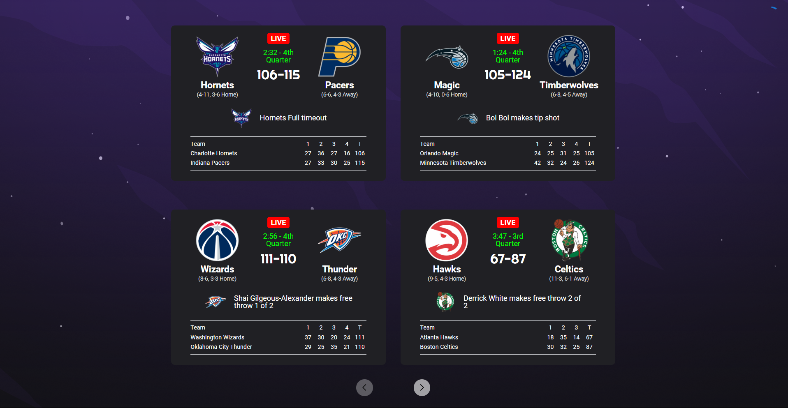

<p align="center">
  
</p>
<h1 align="center">
    
</h1>

## 📚 Sobre 

O projeto **NBA Scoreboard** foi desenvolvido com intuito de exibir os placares de jogos da NBA em tempo real, e que futuramente terá mais funcionalidades que não se limitaram apenas a partidas, também a estatítica.

---


## 🚀 Tecnologias utilizadas

- ReactJS
- Typescript
- Styled Components
- Vite

---

## ⏱ Iniciar projeto 

```bash
# Clonar o repositório
$ git clone https://github.com/hiagomu/nba-scoreboard.git

# Instalar as dependências
$ npm install

# Iniciar o servidor
$ npm run dev

```
---
Desenvolvido por Hiago Murilo
